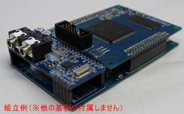
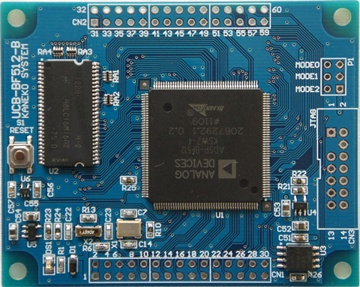
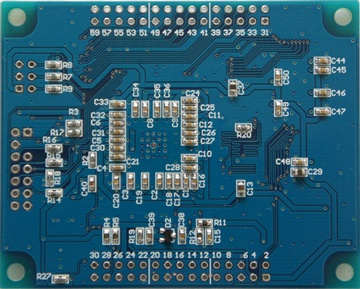
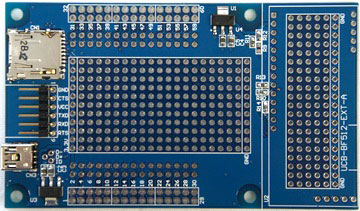
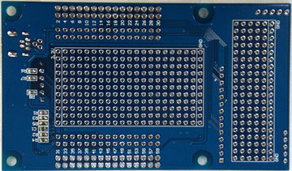
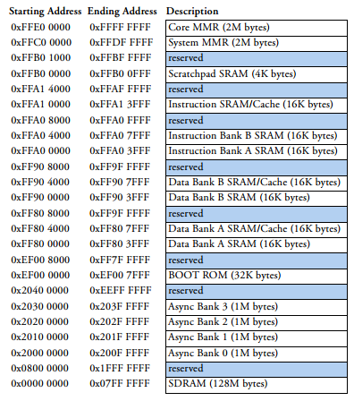
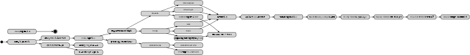

# What's the 'MISO-DEV-2014'

A last day of a year, Japanese people called it 'O-O-MI-SO-KA'.
One of the aliases is 'MISOKA' and I created the project name 'MISO-DEV' from 'the short alias'(MISO) and 'Development'(DEV).
This 'MISO-DEV-2014' is a project on the last day of 2014 using mruby, not a Japanese MISO project. :)
Please see also <https://atnd.org/events/59470>.

# Description

This mruby project is my first mruby project.
The target board is a small ADI Blackfin board and was developed by Kaneko-System in Japan.

I am trying to use mruby on the ADI Blackfin board and am learning mruby in this project.

# The Goal

The goal of this project is very simple.
Running mruby on the target platform is the goal.

# Requirement

## UCB-BF512-B (Kaneko-System)

## UCB-BF512-EXT-A (Kaneko-System)

## TTL-232R-3V3 (FTDI)

## Version of bfin-elf-gcc

> bfin-elf-gcc (ADI-2014R1-RC2) 4.3.5
> Copyright (C) 2008 Free Software Foundation, Inc.
> This is free software; see the source for copying conditions.  There is NO
> warranty; not even for MERCHANTABILITY or FITNESS FOR A PARTICULAR PURPOSE.

# Development Notes

## Memory Map

## bfin-elf-ldr

* <http://blackfin.uclinux.org/doku.php?id=toolchain:ldr-utils>

> $ bfin-elf-ldr --create --help
> Usage: ldr create [options] <arguments>
>
> Options: -[fvqhVp:g:d:B:w:H:s:b:i:P:M]
>   -p, --port            <F|G|H>         * (BF53x) PORT for HWAIT signal
>   -g, --gpio            <#>             * (BF53x) GPIO for HWAIT signal
>   -d, --dma             <#>             * (BF54x) DMA flag
>   -B, --bits            <bits>          * (BF56x) Flash bits (8bit)
>   -w, --waitstate       <num>           * (BF56x) Wait states (15)
>   -H, --holdtimes       <num>           * (BF56x) Flash Hold time cycles (3)
>   -s, --spibaud         <baud>          * (BF56x) SPI boot baud rate (500k)
>   -b, --blocksize       <size>          * Block size of DXE (0x8000)
>   -i, --initcode        <file>          * Init code
>   -P, --punchit         <off:size[:filler]> * Punch an ignore hole
>   -M, --use-vmas                        * Use ELF VMAs for target addresses
>   -f, --force                           * Ignore problems
>   -v, --verbose                         * Make a lot of noise
>   -q, --quiet                           * Only show errors
>   -h, --help                            * Print this help and exit
>   -V, --version                         * Print version and exit

# Install

* Download mruby version 1.1.0 from <http://forum.mruby.org/download/source/mruby-1.1.0.tar.gz>.
* Download the reference for the target board from <http://kaneko-sys.co.jp/datasheet/ucb-bf512/UCB-BF512_users_manual_V4.pdf>.
* Download the schematic for the target board from <http://kaneko-sys.co.jp/datasheet/ucb-bf512/UCB-BF512-B_schematic_V1.pdf>.
* Downlaod the Schematic for the extension board from <http://kaneko-sys.co.jp/datasheet/ucb-bf512-ext/UCB-BF512-EXT-A.pdf>.

# References

## For the processor

* <http://www.analog.com/en/processors-dsp/blackfin/adsp-bf512/products/product.html>
  * Data Sheet : <http://www.analog.com/static/imported-files/data_sheets/ADSP-BF512_514_514F16_516_518_518F16.pdf>
  * Hardware Reference : <http://www.analog.com/static/imported-files/processor_manuals/ADSP-BF51x_hwr_rev1.2.pdf>

## For mruby

* <http://forum.mruby.org/>
  * <http://forum.mruby.org/download/index3.html>
  * <https://github.com/mruby-Forum/mruby>

## For the ADI Blackfin board

* <http://kaneko-sys.co.jp/>
  * UCB-BF512-B : <http://dsps.shop-pro.jp/?pid=82796363>
    * User's Manual : <http://kaneko-sys.co.jp/datasheet/ucb-bf512/UCB-BF512_users_manual_V4.pdf>.
    * Board Schematic : <http://kaneko-sys.co.jp/datasheet/ucb-bf512/UCB-BF512-B_schematic_V1.pdf>.
  * UCB-BF512-EXT-A : <http://dsps.shop-pro.jp/?pid=82796604>
    * Board Schematic : <http://kaneko-sys.co.jp/datasheet/ucb-bf512-ext/UCB-BF512-EXT-A.pdf>
  * Support Page : <http://kaneko-sys.co.jp/support/>
    * **Please do NOT ask them about this project!**
    * **Please see also the license for this project!**

## For the flash writer

* <http://cubeatsystems.com/software/bfin-blueboot/bfin-blueboot_ja.html>
* <http://cubeatsystems.com/software/bfin-blueboot/bfin-blueboot_en.html>

## For the serial cable

* <http://www.ftdichip.com/Products/Cables/USBTTLSerial.htm>

# The development steps

1. Get the target board for the mruby platform.
  * You don't need it if you don't need running mruby on a embedded system.
2. Get the USB to serial interface converter for the programming.
  * Using a JTAG cable is better than the serial interface converter for the programming and the debugging.
3. Install rake, bison for the compiling mruby, bfin-elf-gcc for the compiling Blackfin programs.
  * Using Linux environment is easiest way to setup the development tools.
4. Compile 'uart\_test' for checking your environment.
  * Watch the output of UART, You will see some characters from the test program.

# The Thinking steps

# License

* The license for my codes is MIT.

# Author

Shinichiro Nakamura (CuBeatSystems) @shintamainjp

